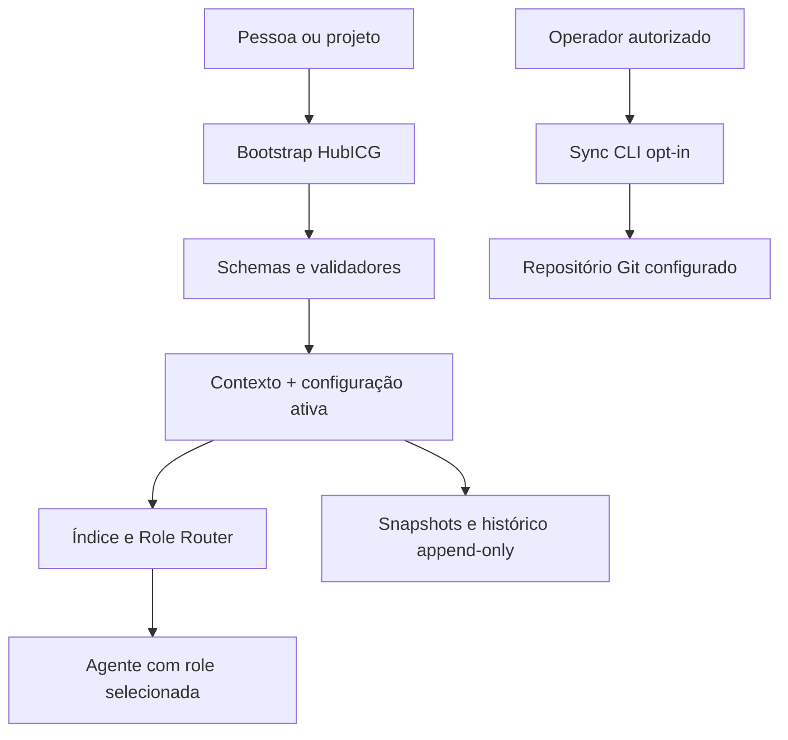

<p align="center">
  
</p>

# HubICG — Hubtech Intent & Context Governance Framework

Framework agnóstico de provedor para governar a interação entre pessoas e
sistemas de inteligência artificial por meio de intenção, contexto, prompts,
roles, guardrails, rastreabilidade e autorização humana explícita.

| Identidade | Valor |
|---|---|
| Nome curto | **HubICG** |
| Nome completo | **Hubtech Intent & Context Governance Framework** |
| HGC module ID | `intent-context-governance` |
| Slug canônico de destino | `hubtech-intent-context-governance-framework` |
| Alias legado | `codex-ai-ml-config` |
| Configuração ativa | v4 |
| Contexto primário | v3 |

> O alias legado permanece apenas para compatibilidade de caminhos, scripts e
> referências históricas. Ele não define o escopo atual do produto.

## Objetivo

O HubICG organiza configuração, governança e evidências para tornar pedidos a
IA mais claros, seguros, econômicos e auditáveis. O objetivo completo inclui:

- identificar intenção, domínio, entregável, riscos e competências;
- sugerir e combinar roles adequadas;
- reescrever prompts com transparência e preservação de sentido;
- compactar contexto e medir tokens, latência e custo;
- aplicar guardrails antes de ações sensíveis;
- auditar chats, decisões, configurações e versões;
- integrar provedores e tecnologias de IA, ML e deep learning sem acoplamento
  obrigatório a um fabricante.

O repositório atual entrega o núcleo de configuração e governança. Ele **ainda
não é** um gateway de inferência, classificador de intenção ou compactador de
prompts em produção.

## Estado real das capacidades

Legenda:

- **Implementado:** existe código ou artefato operacional validado.
- **Parcial:** existe uma parte utilizável, mas faltam componentes relevantes.
- **Especificado:** há contrato ou desenho; não há implementação operacional.
- **Planejado:** faz parte da direção do produto, sem contrato estável.

| Capacidade | Status | Evidência ou limite atual |
|---|---|---|
| Configuração ativa e snapshots | Implementado | Configuração v4 e cadeia append-only; snapshots v1–v3 permanecem imutáveis e o snapshot ativo é comparado integralmente. |
| Biblioteca de roles | Implementado | 60 roles Principal, índice determinístico e SHA-256. |
| Instalação do bootstrap | Implementado | Instaladores Linux/macOS e Windows. |
| Sincronização Git segura | Implementado | Status read-only por padrão; fetch, pull, commit e push exigem flags separadas. |
| Schemas e CI | Implementado | Quatro schemas do núcleo, testes temporários de Git, compilação e secret scan simples; os contratos experimentais do gateway permanecem na `beta`. |
| Auditoria de chats | Parcial | Schema e arquivos append-only; não há importador, redator ou política automatizada de retenção. |
| Identificação/sugestão de role | Parcial | Router declarativo orienta a LLM; não há classificador determinístico. |
| Guardrails | Parcial | Regras de autorização e segurança em prompts; ainda não há policy engine. |
| Extração estruturada de intenção | Especificado | Existe contrato experimental na `beta`; não há extractor executável. |
| Compactação e perfis de contexto | Especificado | Arquitetura experimental; sem compactador executável. |
| Medição de tokens, tempo e custo | Planejado | Não há tokenizer, benchmark ou telemetria de runtime. |
| Reescrita transparente de prompts | Planejado | Não há optimizer, lint ou diff semântico executável. |
| Adapters de provedores e modelos | Planejado | Nenhum SDK ou endpoint de inferência foi implementado no repositório. |

## Arquitetura do núcleo atual



O carregamento seletivo de role ainda é orientado por instrução: o índice
reduz a busca, mas não existe um serviço de runtime que injete automaticamente
somente o trecho escolhido.

## Estrutura

| Caminho | Responsabilidade |
|---|---|
| `.promptsConfig/agentconfig.json` | Configuração ativa do framework |
| `.promptsConfig/agentconfig-history.json` | Índice append-only de versões |
| `.promptsConfig/history/` | Snapshots imutáveis da configuração |
| `.promptsConfig/codex-primary-context.md` | Contexto primário; nome de arquivo legado |
| `.promptsHistory/` | Registros auditáveis de chats e mudanças |
| `.promptsLibrary/role-prompts-ti-senior.md` | Biblioteca versionada de roles |
| `.promptsLibrary/role-index.json` | Índice gerado deterministicamente |
| `.promptsLibrary/MANIFEST.sha256` | Integridade da biblioteca |
| `schemas/` | Contratos JSON da configuração, histórico e roles |
| `scripts/` | Índice, validação, secret scan e sincronização segura |
| `tests/` | Testes de configuração, roles, histórico e operações Git |
| `installers/` | Instalação do bootstrap global |

## Catálogo de roles

| Área | Quantidade |
|---|---:|
| Estratégia, Produto e Discovery | 8 |
| Arquitetura e Desenho de Solução | 7 |
| Engenharia de Software | 5 |
| IA, ML e Sistemas Inteligentes | 3 |
| Qualidade e Testes | 4 |
| DevOps, Plataforma, Cloud e Implantação | 6 |
| Segurança, Privacidade e Governança | 5 |
| Dados, Banco de Dados e Analytics | 6 |
| Gestão Ágil, Entrega e Coordenação Técnica | 6 |
| Operação, Suporte e Pós-implantação | 5 |
| Roles Especializadas Emergentes | 3 |
| Editoração Multiformato e Engenharia de Versionamento | 2 |
| **Total** | **60** |

As duas roles adicionadas no P0 são:

- **Principal Multiformat Publishing Specialist:** trabalha com web, impressão
  e leitura digital; pergunta o formato quando indefinido; trata recriações
  como documentos novos; mantém versões/processo fora do corpo; e reserva
  `Referências` exclusivamente às fontes utilizadas.
- **Principal Git Engineer:** governa DAG, branches, worktrees, remotos,
  migrações e renomeações, separando autorização para commit, push e demais
  mutações.

Consulte o [índice de roles](.promptsLibrary/role-index.json) e a
[biblioteca completa](.promptsLibrary/role-prompts-ti-senior.md).

## Instalação

Pré-requisitos:

- Python 3.11 ou superior;
- Git;
- shell POSIX em Linux/macOS ou PowerShell no Windows.

Linux/macOS:

```sh
./installers/install-codex-framework.sh
```

Windows PowerShell:

```powershell
Set-ExecutionPolicy -Scope Process Bypass
.\installers\install-codex-framework.ps1
```

Os nomes dos instaladores e do arquivo de contexto permanecem legados para não
quebrar integrações existentes. A instalação valida o repositório, preserva um
`AGENTS.md` existente em backup e grava o novo bootstrap atomicamente.

## Validação local

```sh
make ci
```

Ou execute os controles separadamente:

```sh
python3 scripts/validate_codex_config.py
python3 scripts/validate_schemas.py
python3 scripts/build_role_index.py --check
python3 -m unittest discover -s tests -v
python3 scripts/scan_secrets.py
```

## Sincronização: autorização por operação

Sem flags, o comando apenas valida e mostra estado local/cached:

```sh
python3 scripts/sync_codex_config.py
```

Cada mutação exige uma autorização explícita e independente:

```sh
# Atualizar somente a remote-tracking branch
python3 scripts/sync_codex_config.py --branch beta --fetch

# Autorizar fetch + fast-forward em worktree limpo
python3 scripts/sync_codex_config.py --branch beta --pull

# Criar commit local contendo somente o contexto primário
python3 scripts/sync_codex_config.py --branch beta --commit

# Publicar somente commits cujo escopo seja o contexto primário
python3 scripts/sync_codex_config.py --branch beta --push
```

Autorizar uma operação não autoriza outra. O script recusa HEAD destacado,
branch inesperada, divergência, stage preexistente, arquivos fora do escopo e
push forçado. Também não altera `pull.ff` nem resolve conflitos.

Veja a [referência operacional](docs/codex-configuration.md).

## Política de branches

- `main`: baseline estável, validada e utilizável. Mudanças devem preservar
  compatibilidade, snapshots e evidências, passando por revisão e `make ci`.
- `beta`: incubação de contratos, ADRs, blueprints e recursos experimentais.
  Presença na `beta` não equivale a implementação.
- Promoção `beta` → `main`: exige diff explícito, classificação de status,
  migração append-only quando aplicável e todos os quality gates verdes.
- Correções da `main` que também se apliquem à `beta` devem ser portadas de
  forma rastreável, sem sobrescrever a história divergente da branch.

Esta política documenta o processo desejado; proteções de branch no GitHub
precisam ser configuradas e verificadas separadamente.

### Panorama `main` × `beta`

| Branch | Estado após integração do P0 | O que existe | O que não existe |
|---|---|---|---|
| `main` | Configuração ativa v2; contexto v3 | Núcleo estável de configuração, 60 roles, schemas, validação, testes, instaladores e sync opt-in | Gateway de IA, extração/compactação runtime, adapters, banco e telemetria |
| `beta` | Configuração ativa v4; contexto v3 | Núcleo da `main` mais blueprint, backlog, runbook, 10 ADRs `Proposed`, três schemas JSON experimentais e um contrato de provider | Gateway/CLI executável, adapters de provider, banco/migrações, tokenizer, sanitizer e telemetria runtime |

Artefatos em `beta` são especificações em incubação até que código, testes,
critérios de aceite e promoção explícita comprovem sua implementação. Consulte
a [árvore da branch beta](https://github.com/HUBTECH-DEV/hubtech-intent-context-governance-framework/tree/beta).

### Especificações incubadas na `beta`

| Artefato | Status |
|---|---|
| [Blueprint AI/ML](docs/ai-ml-project-blueprint.md) | Proposta técnica |
| [Arquitetura do gateway](docs/architecture/model-agnostic-prompt-optimization-gateway.md) | Proposta; sem runtime |
| [Backlog do gateway](docs/backlog/model-agnostic-prompt-gateway-backlog.md) | Backlog inicial |
| [Runbook local](docs/runbooks/local-gateway-execution.md) | Fluxo pretendido, não comando disponível |
| [ADRs](docs/architecture/prompt-optimization-gateway-index.md) | Dez decisões com status `Proposed` |
| `docs/schemas/` | Três schemas experimentais e um contrato conceitual de provider |

## Segurança e privacidade

- nenhum sync, commit ou push automático;
- validação antes de mutações;
- pull somente fast-forward e worktree limpo;
- push restrito ao contexto autorizado;
- snapshots e históricos anteriores não são reescritos;
- `.env`, ambientes virtuais, caches e logs são ignorados;
- CI executa um scanner simples para formatos comuns de segredo;
- credenciais devem permanecer no mecanismo seguro do sistema/Git.

O scanner incluído é uma camada básica, não substitui secret scanning do
GitHub, revisão humana, SAST, gestão de dependências ou um cofre de segredos.
Históricos de chat não devem receber dados pessoais ou segredos sem política
de minimização, consentimento e retenção aprovada.

## Versionamento e auditoria

A configuração ativa e o contexto primário têm fluxos de versão distintos:

- `agentconfig.json`: v4, ligada aos snapshots `history/vNNNN.json`;
- contexto primário: v3, versionado no frontmatter e no Git.

Mudanças ativas geram nova versão e novo snapshot. Snapshots e entradas
anteriores permanecem imutáveis, inclusive quando conservam nomes ou caminhos
históricos. Renomear não significa apagar a evidência anterior.

## Roadmap

| Fase | Entregas principais |
|---|---|
| P0 — governança confiável | Identidade HubICG, documentação realista, 60 roles, schemas, testes, CI e sync opt-in. |
| P1 — intenção e contexto | Contrato canônico, extrator de intenção, carregamento seletivo, tokenizer e perfis de compactação. |
| P2 — prompts e guardrails | Reescrita com diff, preservação semântica, policy engine, avaliações e quality gates. |
| P3 — runtime agnóstico | Adapters de provedores/modelos, telemetria de latência/custo, cache e auditoria operacional. |
| P4 — aprendizado governado | Feedback, datasets sanitizados, promoção/rollback e avaliação contínua. |

## Referências do projeto

- [Contexto primário](.promptsConfig/codex-primary-context.md)
- [Configuração ativa](.promptsConfig/agentconfig.json)
- [Histórico de configuração](.promptsConfig/agentconfig-history.json)
- [Role Router](.promptsLibrary/role-router.md)
- [Schemas](schemas/)
- [Testes](tests/)
- [Workflow de validação](.github/workflows/validate.yml)
- [Configuração e operação](docs/codex-configuration.md)
- [Repositório canônico de destino](https://github.com/HUBTECH-DEV/hubtech-intent-context-governance-framework)

## Licenciamento

Nenhuma licença foi definida neste baseline. A disponibilidade em um
repositório público, por si só, não concede permissão de uso ou redistribuição
além do que for aplicável.
