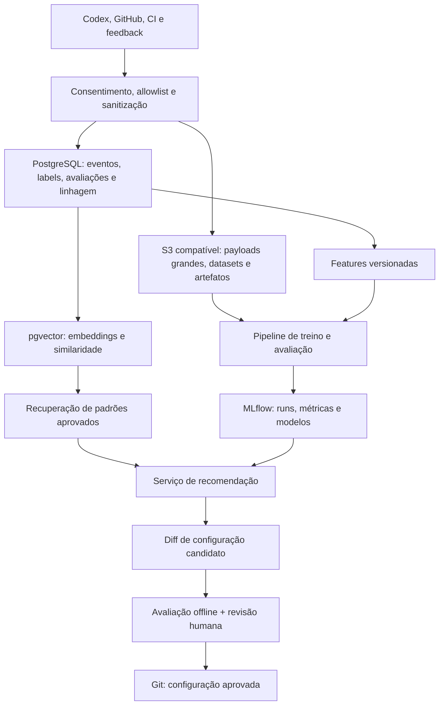

# Blueprint AI/ML para otimização de configurações e prompts

Status: proposta técnica da branch `beta`

Configuração relacionada: versão 2

Última atualização: 2026-07-06

## 1. Objetivo atual

Construir uma plataforma auditável que transforme solicitações e resultados de
desenvolvimento de software em sinais úteis para:

1. extrair intenção, contexto, restrições, preferências e critérios de aceite;
2. selecionar ou recomendar role, persona e padrões de prompt;
3. recuperar configurações que funcionaram em situações semelhantes;
4. medir o quanto a resposta e o código produzido atenderam ao pedido;
5. aprender com feedback, testes, revisão e desfecho da tarefa;
6. propor melhorias versionadas, explicáveis e reversíveis.

O sistema deve reduzir a distância entre pedido e resultado. Na fase beta, ele
recomenda; uma pessoa aprova a promoção. Não haverá alteração autônoma de
configuração, treino com conteúdo não autorizado ou decisão relevante baseada
apenas em sinais implícitos.

### Resultados esperados

- melhor seleção de role e persona;
- maior cobertura de requisitos e restrições;
- menos iterações corretivas;
- prompts menores quando a redução não degrada qualidade;
- reutilização de padrões comprovados;
- regressões detectadas antes da promoção;
- explicação de quais sinais motivaram cada recomendação.

### Fora do escopo inicial

- treinar um foundation model;
- usar código privado sem política explícita de retenção e finalidade;
- aceitar toda edição humana como sinal positivo;
- aprendizado online em produção;
- personalização baseada em atributos sensíveis;
- substituir revisão humana por uma métrica automática.

## 2. Casos de uso

```mermaid
flowchart LR
    requester["Solicitante"] --> capture["UC01 Capturar solicitação e contexto"]
    capture --> intent["UC02 Extrair intenção, restrições e aceite"]
    intent --> route["UC03 Recomendar role e persona"]
    route --> retrieve["UC04 Recuperar padrões similares aprovados"]
    retrieve --> compose["UC05 Compor configuração de prompt"]
    compose --> runtime["Agente de desenvolvimento"]
    runtime --> outcome["UC06 Registrar resposta, diff, testes e revisão"]
    requester --> feedback["UC07 Registrar feedback explícito"]
    outcome --> evaluate["UC08 Avaliar alinhamento e qualidade"]
    feedback --> evaluate
    evaluate --> learn["UC09 Treinar ou recalibrar recomendador"]
    learn --> proposal["UC10 Propor nova versão com explicação"]
    proposal --> reviewer["AI/ML Engineer ou mantenedor"]
    reviewer --> promote["UC11 Aprovar, promover ou rejeitar"]
    promote --> registry["Git e registro de modelos"]
    registry --> compose
    reviewer --> rollback["UC12 Fazer rollback auditado"]
```

### Catálogo resumido

| ID | Caso | Entrada principal | Saída verificável |
|---|---|---|---|
| UC01 | Capturar contexto | pedido, repositório, tarefa, políticas | evento sanitizado e correlacionado |
| UC02 | Extrair intenção | texto e contexto permitido | intenção, entidades, restrições, preferências, aceite e confiança |
| UC03 | Recomendar role/persona | features do pedido | candidatos ranqueados e justificativa |
| UC04 | Recuperar padrões | embedding + filtros | configurações similares aprovadas |
| UC05 | Compor prompt | baseline + candidatos + regras | configuração imutável com hash |
| UC06 | Registrar resultado | resposta, commit/diff, testes, review | outcome vinculado à configuração e revisão |
| UC07 | Obter feedback | nota, escolha, edição, rejeição | label explícita com proveniência |
| UC08 | Avaliar | resultado + critérios | métricas automáticas e humanas |
| UC09 | Aprender | dataset versionado | experimento reproduzível |
| UC10 | Propor versão | modelo + evidências | diff, impacto esperado e riscos |
| UC11 | Promover | quality gates | versão aprovada e auditada |
| UC12 | Reverter | versão anterior | rollback sem apagar histórico |

### Sinais do desenvolvimento de código

Use sinais com interpretação explícita:

- testes aprovados/reprovados e cobertura relevante;
- aderência a lint, type checking e políticas de segurança;
- comentários de revisão classificados por tema;
- aceitação, edição ou rejeição do diff;
- quantidade e causa das iterações;
- conclusão, reabertura ou rollback da tarefa;
- feedback direto do solicitante;
- latência e custo, sempre como métricas secundárias à qualidade.

Merge não equivale automaticamente a alta qualidade. Revert, aprovação
administrativa e ausência de comentário também não são labels suficientes.

## 3. Fluxo de dados e aprendizagem

### Contrato mínimo de evento

Todo evento elegível deve conter:

- `event_id`, `occurred_at`, `event_type` e versão do schema;
- projeto, sessão e tarefa por identificadores pseudonimizados;
- revisão Git e provedor, quando aplicável;
- `prompt_config_version`, hash e componentes utilizados;
- provedor/modelo e parâmetros não secretos;
- origem do sinal e grau de confiança;
- política de consentimento, classificação e retenção;
- ponteiro para payload sanitizado, nunca segredo bruto.

## 4. Avaliação das opções de armazenamento

### Recomendação

Adotar uma arquitetura híbrida desde o MVP:

| Camada | Escolha beta | Responsabilidade |
|---|---|---|
| Configuração | Git | roles, personas, templates, schemas, evaluators e aprovações |
| Operacional + vetorial | PostgreSQL + pgvector | metadados, eventos, labels, auditoria, avaliações, features iniciais e embeddings |
| Objetos | S3 compatível | transcrições sanitizadas, Parquet, snapshots de datasets e artefatos |
| Experimentos | MLflow sobre PostgreSQL + S3 | runs, parâmetros, métricas, traces, modelos e promoção |

Essa composição mantém transações e filtros relacionais próximos dos vetores,
evita uma infraestrutura vetorial separada antes de haver escala comprovada e
preserva artefatos grandes fora do banco operacional.

### Matriz de decisão

Notas: 1 = fraco, 5 = forte para esta fase. A pontuação é uma decisão de
arquitetura, não um benchmark.

| Opção | Estrutura e auditoria | Busca semântica | Artefatos grandes | Operação no MVP | Recomendação |
|---|---:|---:|---:|---:|---|
| Git | 5 | 1 | 1 | 5 | canônico para configuração, não para telemetria |
| PostgreSQL + pgvector | 5 | 4 | 2 | 5 | datastore principal |
| S3/MinIO | 3 | 1 | 5 | 4 | obrigatório para datasets/artefatos |
| MLflow | 5 | 1 | 4 | 4 | iniciar com o primeiro experimento |
| Qdrant | 3 | 5 | 2 | 3 | adiar até limiar objetivo |
| Feast | 4 | 1 | 2 | 2 | adiar até reuso online de features |
| Redis | 2 | 2 | 1 | 4 | cache futuro, nunca source of truth |
| ClickHouse/warehouse | 4 | 2 | 3 | 2 | adiar até volume analítico justificar |

### PostgreSQL + pgvector

Vantagens:

- relaciona embedding, configuração, feedback e auditoria em uma transação;
- suporta busca exata e aproximada com HNSW/IVFFlat;
- combina filtros SQL, full-text search e busca vetorial;
- simplifica backup, controle de acesso e desenvolvimento local.

Limites:

- índices HNSW consomem memória e exigem monitoramento de recall;
- filtragem altamente seletiva e volume vetorial muito alto podem exigir
  particionamento ou mecanismo especializado;
- payloads grandes e artefatos de modelo não devem residir no banco.

Decisão: primeira escolha. Começar com busca exata; criar HNSW somente após
medir volume, latência e recall.

### Object storage S3 compatível

Vantagens:

- adequado a Parquet, datasets, modelos, anexos e traces volumosos;
- versionamento, lifecycle e custo por camada;
- desacopla compute e storage e integra com MLflow.

Limites:

- não substitui catálogo, transações ou consulta relacional;
- precisa de checksums, manifesto, criptografia, política de retenção e
  eliminação coordenada.

Decisão: usar em conjunto com PostgreSQL. Em ambiente local/on-premises,
considerar MinIO; em cloud, usar o serviço S3 compatível aprovado.

### MLflow

Vantagens:

- rastreia runs, parâmetros, métricas, traces e modelos;
- usa banco relacional como backend e object storage para artefatos;
- permite associar cada recomendador ao dataset e à avaliação.

Limites:

- não é o datastore transacional da aplicação;
- governança de promoção continua exigindo quality gates e CI/CD.

Decisão: ativar quando o primeiro baseline treinável existir; antes disso,
eventos e avaliações já devem estar versionados.

### Qdrant

Vantagens:

- busca vetorial especializada, payload JSON, filtros e consultas híbridas;
- melhor caminho quando vetores e latência dominarem o workload.

Limites:

- cria uma segunda fonte operacional e exige sincronização com a linhagem
  relacional;
- aumenta backup, observabilidade, consistência e custo operacional.

Decisão: não usar no MVP. Reavaliar se testes mostrarem que PostgreSQL não
atinge o SLO com o corpus e filtros reais, ou quando a separação de carga
vetorial for necessária.

### Feast

Vantagens:

- distingue features históricas para treino de features online de baixa
  latência;
- ajuda a obter datasets point-in-time correct e reutilizar features.

Limites:

- adiciona registry, materialização e stores antes de existir demanda;
- não substitui o armazenamento de eventos ou experimentos.

Decisão: não usar no MVP. Adotar apenas quando múltiplos modelos/serviços
compartilharem features e houver risco mensurável de training-serving skew.

## 5. Modelo lógico inicial

| Entidade | Finalidade |
|---|---|
| `projects` | tenant, políticas, retenção e finalidade autorizada |
| `sessions` | correlação de uma interação sem guardar identidade direta |
| `messages` | conteúdo sanitizado ou ponteiro para object storage |
| `intent_extractions` | intenção, entidades, restrições, aceite e confiança |
| `prompt_configs` | composição e hash de role/persona/template/parâmetros |
| `prompt_config_versions` | linhagem, diff, aprovação e rollback |
| `feedback_events` | feedback explícito/implícito e sua interpretação |
| `code_outcomes` | revisão, diff permitido, CI, review e desfecho |
| `evaluations` | métricas, evaluator, versão e evidências |
| `embeddings` | vetor, modelo, dimensão, conteúdo-fonte e política |
| `datasets` | manifesto, split, período, finalidade e checksum |
| `experiments` | run/model/dataset/config e métricas |
| `recommendations` | candidatos, score, explicação e decisão humana |
| `audit_log` | ações append-only e identidade do executor |

Dados brutos e dados derivados precisam de IDs e políticas distintas. Apagar
um dado por retenção deve invalidar ou reconstruir derivados relacionados.

## 6. Estratégia de machine learning

### Estágio A — instrumentação e baseline determinístico

- definir schemas e sanitização;
- construir gold set revisado;
- medir regras atuais de roteamento;
- recuperar exemplos semelhantes aprovados;
- estabelecer uma configuração baseline congelada.

### Estágio B — extração e ranking supervisionado

- modelo de extração estruturada com campos obrigatórios e confiança;
- classificador/ranker de role e persona;
- learning-to-rank com preferências pareadas;
- calibração e opção de abstenção quando confiança for baixa.

### Estágio C — otimização controlada

- geração de candidatos restrita a componentes permitidos;
- avaliação offline contra gold set e tarefas temporais futuras;
- shadow mode e canário somente com aprovação;
- contextual bandit apenas após definir reward resistente a manipulação e
  limites de exploração.

Nunca treinar e avaliar na mesma família de tarefa/repositório. Dividir dados
por tempo e projeto para reduzir leakage e memorizações artificiais.

## 7. Métricas e quality gates

### Extração e roteamento

- F1 por campo de intenção;
- recall de restrições e critérios de aceite;
- acurácia top-1/top-3 de role/persona;
- calibração e taxa de abstenção.

### Resultado do desenvolvimento

- taxa de sucesso dos critérios de aceite;
- testes e verificações relevantes aprovados;
- preferência pareada do solicitante/revisor;
- redução de iterações sem aumento de regressão;
- taxa de rollback/reabertura;
- violações de segurança e privacidade.

### Operação

- latência p50/p95;
- custo por tarefa concluída;
- disponibilidade do recomendador;
- drift de dados, embeddings e reward;
- cobertura de linhagem ponta a ponta.

Gate beta recomendado: nenhuma regressão crítica, zero vazamento conhecido,
linhagem completa, melhoria estatisticamente defensável no gold set e aprovação
humana registrada. Metas numéricas devem ser definidas depois do baseline, não
inventadas antecipadamente.

## 8. Sugestões priorizadas

### P0 — fundação

1. Formalizar schemas versionados para evento, extração, feedback e avaliação.
2. Implementar sanitização/allowlist antes de qualquer persistência.
3. Definir taxonomia de intenção, restrição, preferência e critério de aceite.
4. Criar gold set pequeno, diverso e revisado por duas pessoas.
5. Associar cada outcome ao hash de configuração, modelo e revisão Git.
6. Definir consentimento, retenção e processo de eliminação de dados.

### P1 — MVP útil sem treino complexo

1. Provisionar PostgreSQL + pgvector e object storage S3 compatível.
2. Implementar extração estruturada com validação de schema.
3. Criar recuperação híbrida de configurações aprovadas.
4. Criar evaluators determinísticos e revisão humana pareada.
5. Expor recomendação como diff explicável, nunca escrita automática.
6. Integrar eventos de CI/review por webhooks idempotentes.

### P2 — aprendizado supervisionado

1. Ativar MLflow e manifests de dataset.
2. Treinar baseline de roteamento e ranking de preferências.
3. Comparar sempre contra heurística e configuração atual.
4. Rodar shadow mode e análise por projeto/tipo de tarefa.
5. Promover somente por pipeline com gates e rollback.

### P3 — escala

1. Separar Qdrant se o SLO vetorial não couber no PostgreSQL.
2. Introduzir Feast se features online forem compartilhadas.
3. Adotar warehouse quando retenção/volume tornarem analytics operacional
   inadequado no PostgreSQL.
4. Avaliar bandit apenas com reward validado e orçamento de exploração.

## 9. Próximas decisões

Antes da implementação, confirmar:

1. quais fontes podem fornecer feedback e outcomes;
2. que conteúdo de prompts/código pode ser persistido;
3. política de anonimização, retenção e exclusão;
4. provedor de embeddings/modelos permitido;
5. volume e SLO estimados;
6. owner da aprovação de configurações/modelos;
7. destino GitHub (`HUBTECH-DEV/codex-ai-ml-config`) e política de publicação.

## 10. Referências técnicas

- [pgvector: busca vetorial, HNSW, IVFFlat, filtros e busca híbrida](https://github.com/pgvector/pgvector)
- [MLflow: backend stores](https://mlflow.org/docs/latest/self-hosting/architecture/backend-store/)
- [MLflow: artifact stores](https://mlflow.org/docs/latest/self-hosting/architecture/artifact-store/)
- [Qdrant: hybrid e multi-stage queries](https://qdrant.tech/documentation/search/hybrid-queries/)
- [Qdrant: payload e filtros](https://qdrant.tech/documentation/concepts/payload/)
- [Feast: componentes, offline/online stores e materialização](https://docs.feast.dev/getting-started/components/overview)
- [MinIO: object storage S3 compatível](https://min.io/product/s3-compatibility)
