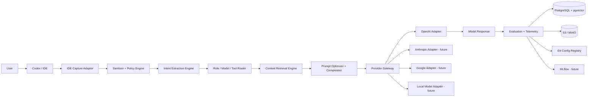
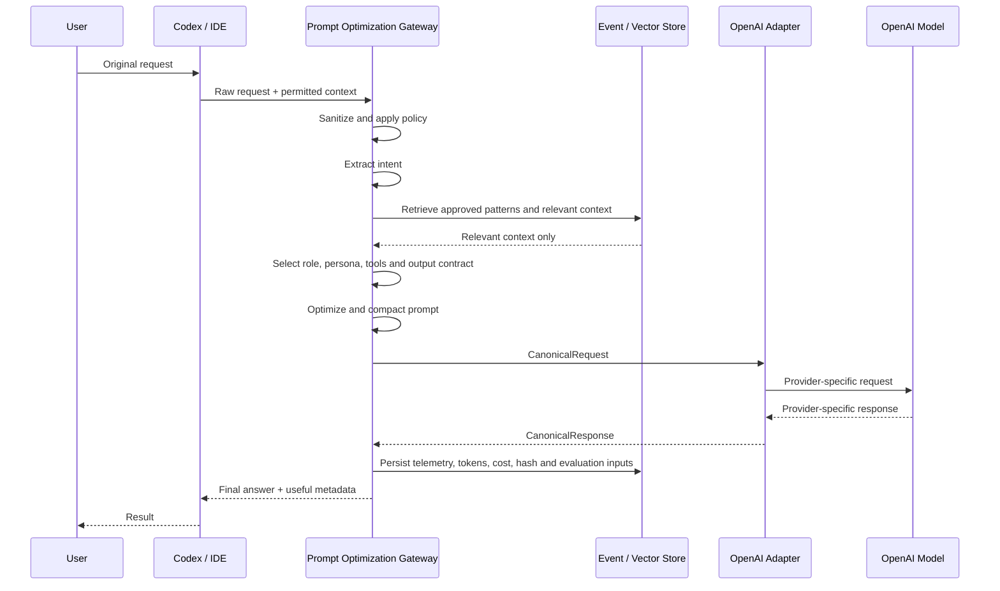

# Model-Agnostic Prompt Optimization Gateway

Status: proposal  
Target branch: `beta`  
Audience: developers, maintainers, sponsors and technical decision makers  
Initial provider: OpenAI  
Initial IDE/agent surface: Codex  
Architecture stance: model-agnostic by contract, OpenAI-first by implementation

---

## 1. Executive summary

This project proposes a local or near-local gateway that runs in parallel to the IDE and acts as a controlled interface between developer requests and AI models.

The gateway receives raw requests from Codex or another IDE/agent surface, sanitizes the input, extracts intent, selects the appropriate role and context, applies prompt optimization techniques, routes the cleaned request to a model provider, and records lineage, metrics, cost, feedback and evaluation results.

The first implementation targets OpenAI models and Codex-oriented workflows. The core domain, however, must remain independent from OpenAI APIs. OpenAI is only the first `ProviderAdapter`.

The project should be understood as a control plane for:

- prompt configuration;
- context optimization;
- role and persona routing;
- model routing;
- token and cost governance;
- evaluation lineage;
- safe promotion of improved configurations.

---

## 2. Problem statement

Modern AI-assisted development workflows usually send excessive, duplicated or poorly structured context to the model. This increases token cost, latency and cognitive noise, while making results harder to evaluate and reproduce.

Common failure modes:

- full role libraries loaded when only one role is needed;
- repeated global rules across many prompts;
- prompts mixed with documentation intended for humans;
- missing traceability between prompt, model, output and review outcome;
- no stable contract for switching model providers;
- no quality gate before promoting prompt changes;
- no reliable distinction between useful compression and harmful information loss.

The gateway solves this by turning prompts into versioned, measurable and auditable runtime artifacts.

---

## 3. Goals

### 3.1 Primary goals

1. Receive requests from Codex or another IDE-adjacent interface.
2. Sanitize requests before persistence or model invocation.
3. Extract task intent, constraints, preferences and acceptance criteria.
4. Select role, persona, tools and output contract.
5. Retrieve only the context required by the task.
6. Optimize and compact prompts without losing semantic requirements.
7. Route the canonical request to OpenAI initially and to other providers later.
8. Persist prompt configuration hash, model parameters, token usage, cost, latency and outcome signals.
9. Evaluate whether compression improved efficiency without degrading output quality.
10. Propose prompt and routing improvements through explainable, reversible and human-approved changes.

### 3.2 Non-goals for MVP

- Training a foundation model.
- Replacing human review.
- Learning online in production.
- Persisting secrets or sensitive code without explicit policy.
- Automatically promoting prompt, model or routing changes.
- Supporting all IDEs on day one.
- Building a general-purpose AI agent platform before the gateway contract is stable.

---

## 4. Architecture principles

### 4.1 Model agnosticism

The core must not depend on OpenAI-specific request/response shapes.

The domain model should speak in terms of:

- `CanonicalRequest`;
- `CanonicalResponse`;
- `ProviderAdapter`;
- `ModelCapabilities`;
- `PromptConfig`;
- `CompressionProfile`;
- `EvaluationResult`.

OpenAI, Anthropic, Google, Ollama, vLLM or any future provider must be implemented behind adapter boundaries.

### 4.2 OpenAI-first implementation

OpenAI is the first adapter because it is the current target for Codex-oriented workflows and offers strong support for tool calling, structured outputs, token accounting, model families and prompt caching.

This must not leak into the core package.

### 4.3 Prompt as configuration, not prose

Prompt configuration must be modeled as a composed artifact:

```yaml
prompt_config:
  core_rules_version: string
  role_version: string
  persona_version: string
  router_version: string
  compression_profile_version: string
  provider_adapter_version: string
  output_contract_version: string
  hash: string
```

### 4.4 Selective context loading

The gateway must not load the whole role library, project documentation or historical chat context by default.

Runtime prompt assembly should load:

1. global rules required by policy;
2. selected role delta;
3. selected output contract;
4. task-specific context;
5. retrieved patterns that passed relevance and policy gates.

### 4.5 Human-in-the-loop governance

The system may recommend improved prompt configurations, model routing policies or compression profiles.

It must not promote them automatically during beta.

Required human approval:

- prompt configuration promotion;
- model routing policy change;
- aggressive compression as default;
- sensitive-data handling policy change;
- provider change for privileged workflows;
- any change that increases security, privacy, compliance, availability or cost risk.

### 4.6 Compression must be evaluated

A shorter prompt is not necessarily a better prompt.

Compression must be accepted only when it preserves:

- user intent;
- constraints;
- acceptance criteria;
- safety rules;
- instruction precedence;
- output contract;
- enough context for execution.

---

## 5. High-level architecture



---

## 6. Runtime sequence



---

## 7. Core components

### 7.1 IDE Capture Adapter

Receives requests from the developer surface.

MVP options:

| Mode | Description | Complexity | Recommendation |
|---|---|---:|---|
| CLI wrapper | Local command receives prompt and invokes gateway | Low | MVP default |
| Local HTTP daemon | IDE or scripts call `localhost` endpoint | Medium | MVP target |
| IDE extension | Native extension for VS Code/Cursor/etc. | High | Later |

Recommended MVP:

```text
CLI wrapper + local HTTP daemon
```

### 7.2 Sanitizer + Policy Engine

Responsibilities:

- secret detection;
- sensitive-data redaction;
- allowlist validation;
- payload classification;
- retention policy tagging;
- blocking unsafe persistence;
- blocking unsafe provider calls;
- recording policy decision evidence.

The sanitizer must run before any persistence or model invocation.

### 7.3 Intent Extraction Engine

Produces a structured representation of the request:

```yaml
intent_extraction:
  task_type: code_generation | refactor | bugfix | architecture | documentation | review | research
  domain: string
  deliverable: string
  constraints: []
  acceptance_criteria: []
  risks: []
  missing_information: []
  confidence: float
```

### 7.4 Role / Persona Router

Selects:

- primary role;
- auxiliary roles only when strictly required;
- persona/communication mode;
- output contract;
- autonomy level;
- required human decision points.

### 7.5 Context Retrieval Engine

Retrieves only what the task requires:

- selected files or file chunks;
- approved prompt patterns;
- role deltas;
- architecture decisions;
- recent relevant decisions;
- previous outcomes with similar intent;
- tests, diffs or CI results when applicable.

Initial implementation:

```text
PostgreSQL + pgvector + full-text search
```

### 7.6 Prompt Optimizer + Compressor

Core responsibility: produce the smallest safe prompt that preserves required behavior.

Techniques:

| Technique | Purpose |
|---|---|
| Deduplication | Remove repeated global rules |
| Role delta | Load only role-specific differences |
| Context slicing | Select relevant context chunks |
| Semantic compression | Convert prose into compact structured fields |
| Prompt linting | Remove vague, duplicate or conflicting instructions |
| Token budget allocation | Allocate tokens by prompt layer |
| Cache-aware layout | Put stable prefix before dynamic context |
| Tool minimization | Send only required tools |
| Output contract compression | Replace long prose with schema |
| Retrieval gating | Reject irrelevant retrieved content |

### 7.7 Provider Gateway

The provider gateway maps canonical requests to provider-specific APIs.

Core interface:

```typescript
interface ModelProvider {
  name: string;
  capabilities(): ModelCapabilities;
  countTokens(req: CanonicalRequest): Promise<TokenEstimate>;
  invoke(req: CanonicalRequest): Promise<CanonicalResponse>;
  stream(req: CanonicalRequest): AsyncIterable<ModelEvent>;
}
```

### 7.8 OpenAI Adapter

Initial adapter mapping:

| Canonical field | OpenAI field |
|---|---|
| `instructions` | `instructions` |
| `messages/context_blocks` | `input` |
| `model_profile` | `model` |
| `max_output_tokens` | `max_output_tokens` |
| `tools` | `tools` |
| `tool_policy` | `tool_choice` |
| `metadata` | `metadata` |
| `cache_key` | `prompt_cache_key` |
| `streaming` | `stream` |
| `conversation_state` | `conversation` or `previous_response_id` |

---

## 8. Prompt caching strategy

Prompt layout should maximize semantic correctness first and cache efficiency second.

Recommended order:

```text
[STATIC PREFIX]
- core rules
- selected role delta
- output contract
- stable tool schemas
- stable provider instructions

[DYNAMIC SUFFIX]
- current user request
- selected files/chunks
- diffs
- retrieved examples
- task-specific acceptance criteria
```

Rule:

```text
Stable content goes first. Variable task context goes last.
```

---

## 9. Compression profiles

```yaml
compression_profiles:
  conservative:
    preserve_all_constraints: true
    summarize_context: false
    remove_duplicates: true
    convert_to_schema: false

  balanced:
    preserve_all_constraints: true
    summarize_context: true
    remove_duplicates: true
    convert_to_schema: true
    use_role_delta: true

  aggressive:
    preserve_all_constraints: true
    summarize_context: true
    convert_to_schema: true
    use_role_delta: true
    remove_examples_unless_required: true
    require_eval_before_default_use: true
```

Aggressive compression must not be used by default for security, legal, production, IAM, secrets, data migration, destructive or high-risk tasks.

---

## 10. Data architecture

### 10.1 MVP storage

| Layer | Technology | Responsibility |
|---|---|---|
| Config registry | Git | Roles, prompt configs, schemas, ADRs, approvals |
| Operational store | PostgreSQL | Events, sessions, evaluations, labels, lineage |
| Vector search | pgvector | Embeddings and similarity search |
| Object storage | S3-compatible / MinIO | Large sanitized payloads, datasets, traces, artifacts |
| Experiment tracking | MLflow | Later, when trainable baselines exist |

### 10.2 Logical entities

- `projects`
- `sessions`
- `messages`
- `intent_extractions`
- `prompt_configs`
- `prompt_config_versions`
- `feedback_events`
- `code_outcomes`
- `evaluations`
- `embeddings`
- `datasets`
- `experiments`
- `recommendations`
- `audit_log`

---

## 11. Quality gates

A compressed or newly routed prompt configuration may be promoted only if:

```yaml
quality_gate:
  required:
    - zero_known_secret_leak
    - full_prompt_config_lineage
    - no_critical_regression
    - acceptance_criteria_preserved
    - constraint_recall_not_worse_than_baseline
    - human_approval_for_promotion
  measured:
    - token_reduction_percent
    - cached_tokens_ratio
    - latency_p50
    - latency_p95
    - cost_per_successful_task
    - role_adherence_score
    - output_completeness_score
```

---

## 12. MVP definition

### 12.1 MVP name

```text
AI Gateway for Codex Prompt Optimization
```

### 12.2 MVP capabilities

The MVP must:

1. run locally as CLI and/or daemon;
2. receive a raw development request;
3. sanitize the request;
4. extract structured intent;
5. select a role and output contract;
6. retrieve minimal context;
7. compact the prompt using a conservative or balanced profile;
8. invoke OpenAI through the provider adapter;
9. persist prompt hash, model, token usage, cost and latency;
10. return the model response and gateway metadata.

### 12.3 MVP success criteria

Given a small benchmark of real development tasks, the gateway should reduce input tokens without reducing recall of constraints or acceptance criteria, while preserving complete lineage between request, prompt configuration, model, response and evaluation.

---

## 13. Recommended repository structure

```text
apps/
  aigw-cli/
  aigw-daemon/
packages/
  core/
    canonical_request/
    canonical_response/
    prompt_config/
    policy/
    telemetry/
  optimizer/
    dedupe/
    semantic_compression/
    token_budget/
    cache_layout/
  router/
    intent/
    role/
    provider/
    model/
  providers/
    openai/
    anthropic/
    google/
    local/
  storage/
    postgres/
    pgvector/
    object_store/
  evals/
    deterministic/
    llm_judge/
    human_review/
configs/
  providers/
  compression_profiles/
  policies/
docs/
  architecture/
  adr/
  backlog/
  runbooks/
  schemas/
scripts/
  validate_config.py
  count_tokens.py
  build_role_index.py
```

---

## 14. Main risks

| Risk | Impact | Mitigation |
|---|---|---|
| Compression removes a critical constraint | High | Constraint recall gate |
| Gateway increases latency | Medium/High | Caching, streaming and profile selection |
| Secret persistence | High | Sanitizer before storage |
| OpenAI coupling | Medium | Provider adapter from MVP |
| Wrong model routing | Medium | Confidence threshold and human fallback |
| Biased automatic evaluation | High | Gold set and human review |
| Context growth | Medium | Token budget and retrieval gating |
| Higher operational cost | Medium | Cost per successful task metric |
| Codex workflow incompatibility | Medium | Start with wrapper and daemon |
| Silent prompt regression | High | Prompt regression tests |

---

## 15. Decision backlog

Before implementation, decide:

1. CLI-only MVP or CLI plus local HTTP daemon.
2. Go or Python as primary implementation language.
3. How Codex will call the gateway initially.
4. Which repository contents may be persisted.
5. Whether prompts/responses may be stored fully or only as sanitized pointers.
6. Which OpenAI models are allowed in beta.
7. Which tasks require mandatory human approval.
8. Whether GitHub remains the first registry or GitLab CE becomes the canonical registry.
9. Retention policy for prompts, responses, diffs and embeddings.
10. Maximum token budget by task class.

---

## 16. Recommended next step

Implement the MVP as a local gateway with:

```text
CLI wrapper -> local daemon -> OpenAI adapter -> PostgreSQL telemetry
```

The first delivery should prove that the framework can safely reduce prompt size, preserve requirements, call a provider through an abstraction layer and persist enough evidence to compare outputs against a baseline.
